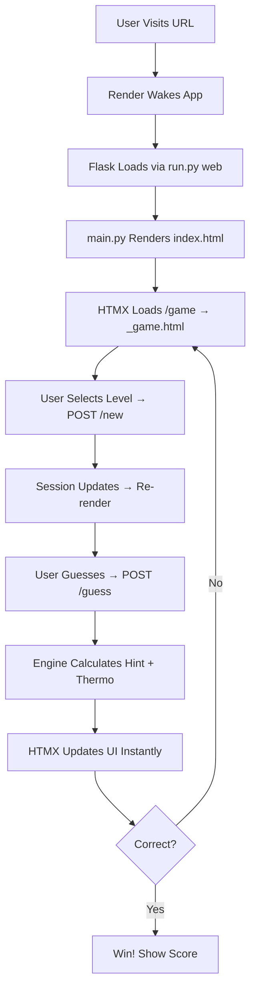

# Number Guessing Game 🌟

A **fun, interactive, and addictive** number guessing game with **real-time feedback**, **difficulty levels**, and a **dynamic thermometer**!  
Deployed live on **Render** — play it now!

[](https://number-guessing-game-4814.onrender.com)

---

## 🚀 Live Demo

👉 **[https://number-guessing-game-4814.onrender.com](https://number-guessing-game-4814.onrender.com)**

---

## 🖼️ Screenshot


---

## 🎮 Features

- **3 Difficulty Levels**: Easy (1–50), Medium (1–100), Hard (1–200)
- **Real-time Thermometer** — gets hotter as you get closer!
- **Score System** — higher score for fewer guesses
- **Session Persistence** — game state saved across reloads
- **Responsive Design** — works on mobile & desktop
- **HTMX-Powered** — smooth, no-page-reload interactions

---

🏗️ Project Structure
```
.
├── platforms/
│   └── web/
│       ├── main.py           # Flask app logic
│       ├── templates/
│       │   ├── index.html
│       │   └── game.html
│       └── static/
│           └── style.css
├── core/                   # Game engine, state, scoring
├── shared/                 # Utils, themes, sounds
├── run.py                  # Entry point: python run.py web
├── requirements.txt
├── render.yaml
└── assets/
    └── game-screenshot.png
```
---

## 🔄 Workflow (Mermaid Diagram)


---

## 🛠️ Tech Stack

| Layer       | Tech                          |
|-------------|-------------------------------|
| **Backend** | Python, Flask                 |
| **Frontend**| HTML, CSS, HTMX               |
| **Deploy**  | Render (Free Tier)            |
| **State**   | Flask Session (in-memory)     |

---

## Local Setup

```bash
git clone https://github.com/CaSh007s/number-guessing-game.git
cd number-guessing-game
pip install -r requirements.txt
python run.py web
```

## Author

**Kalash**  
**GitHub:** [CaSh007s](https://github.com/CaSh007s)

---

## Future Ideas

- [ ] Multiplayer mode  
- [ ] Leaderboard (Supabase)  
- [ ] Sound effects (Web Audio API)  
- [ ] PWA + Mobile App  
- [ ] Dark/Light theme toggle

---

**Star this repo if you enjoyed the game!** ⭐
___
